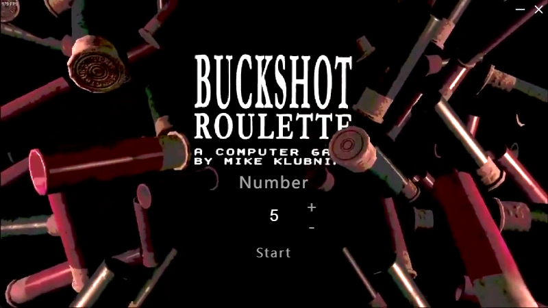
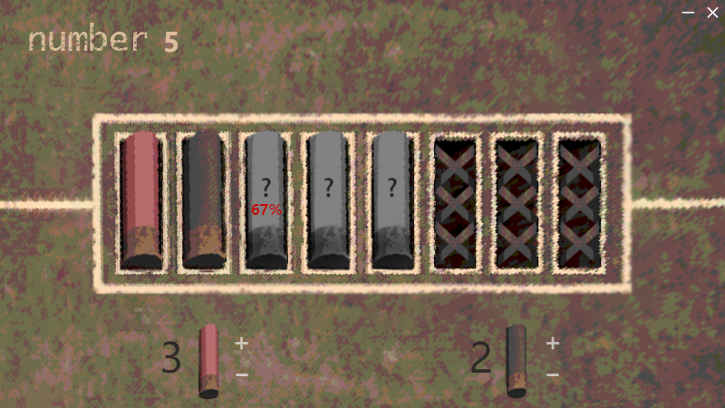

# Roulette Predictor

## 💻 环境要求

- Node.js: 版本 >= 16.17.0


## 🎲 简介
Roulette Predictor 是一款专门为《Buckshot Roulette》游戏设计的概率计算工具。该工具旨在帮助玩家更好地预测每轮游戏中子弹的分布情况，从而制定更加有效的游戏策略，提高胜率。


## 🛠 安装
```bash
npm install
```
## 🚀 快速开始
安装完成后，可以使用以下命令启动程序：
```bash
npm start
```

## 🖥️界面预览


